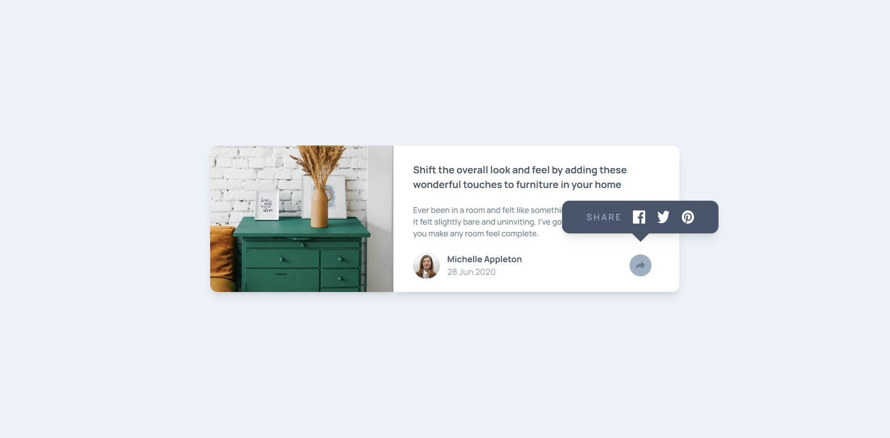

# Frontend Mentor - Article preview component solution

This is a solution to the [Article preview component challenge on Frontend Mentor](https://www.frontendmentor.io/challenges/article-preview-component-dYBN_pYFT). 

### The challenge

Users should be able to:

- View the optimal layout for the component depending on their device's screen size
- See the social media share links when they click the share icon

### Screenshot

### Links

- Solution URL: [https://github.com/Alexandru-Enescu/responsive-article-preview](https://github.com/Alexandru-Enescu/responsive-article-preview)
- Live Site URL: [https://alexandru-enescu.github.io/responsive-article-preview/](https://alexandru-enescu.github.io/responsive-article-preview/)

## Author

- Frontend Mentor - [@Alexandru-Enescu](https://www.frontendmentor.io/profile/Alexandru-Enescu)
- GitHub - [@Alexandru-Enescu](https://github.com/Alexandru-Enescu)
